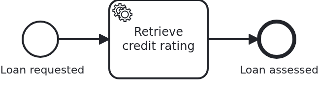

# Workflow aggregates in MongoDB

[](./LICENSE)

An application does not need a relational database to run VanillaBP. This blueprint is the
proof: the same loan approval as the base blueprint, with the workflow aggregate in MongoDB and
no data source anywhere in the project. A delta on top of `module-single`.

What makes it more than a swapped repository is the count: a workflow needs **three** stores,
and all three of them move.

## What this blueprint shows



The loan approval of the base blueprint, unchanged: one service task, started through a GET
request, and an aggregate the task fills. The process is not the point here, the database is.

The three stores of a workflow, and where they are:

|           Store            |                     What it is for                      |        Where it lives        |
|----------------------------|---------------------------------------------------------|------------------------------|
| the workflow aggregate     | the state of the business case, your own data           | collection `LOAN_APPROVAL`   |
| the phase-two outbox       | makes a workflow start on a remote BPMS survive a crash | `vanillabp-phase-two-outbox` |
| the log of delivered tasks | keeps a repeated delivery from running a handler twice  | `vanillabp-task-deliveries`  |

Only the first one is written by this application's code. The other two are VanillaBP's, and
they follow the aggregate: declaring the repository as a MongoDB one is what moves them, no
property says it. That is why an application which stores its aggregate in MongoDB but keeps a
data source around for "the framework" has misunderstood something - there is nothing left to
put in there.

**One class more than the base blueprint, and it is the interesting one.**
`config/MongoTransactions` defines a `MongoTransactionManager`. With a relational database the
platform contributes a manager itself, for MongoDB it deliberately does not: a MongoDB
transaction requires the deployment to be a **replica set**, and no framework can know whether
yours is one. So the application says it, and VanillaBP asks for it while starting up instead
of assuming it. Booting names the answer, one line per aggregate:

```
Workflow aggregate 'blueprint.workflowmodule.loanapproval.model.Aggregate' (BPMN process
'loan_approval' of workflow module 'loan-approval') is processed in the transaction of: the
transaction manager of the application ('org.springframework.data.mongodb.MongoTransactionManager')
```

Read that line. It says which transaction everything VanillaBP does with this aggregate runs
in: loading it, the `@WorkflowTask` method, saving it, the outbox entry and the delivery record
either all commit or none of them do. Without the manager the application does not start, and
the message names the ways out. On a standalone MongoDB it starts and warns, because every
transactional write will fail there.

**Camunda 7 is missing on purpose.** Its engine is embedded and needs a relational database,
which is exactly what this blueprint does not have. Running the two together is possible, and
then the engine and the aggregate commit separately - a compromise worth knowing about, but not
what a blueprint about MongoDB should demonstrate. So this is the first blueprint with a single
engine, and a cluster has to run for every build.

**The counter-check is in the test**, because the happy path proves nothing here:
`LoanApprovalIT#aFailedStartLeavesNothingBehind` rolls the transaction back after a workflow was
started and asserts that neither the aggregate nor the outbox entry survived. Before the
framework taught its MongoDB stores to write through the same session, that assertion failed on
its second half.

## Delta to the base blueprint

Compared to [`module-single`](https://github.com/vanillabp-blueprints/module-single-springboot):

|                            File                            |                                     What is different                                     |
|------------------------------------------------------------|-------------------------------------------------------------------------------------------|
| `.../loanapproval/model/Aggregate.java`                    | a document in a collection instead of an entity in a table, and no column declarations    |
| `.../loanapproval/model/AggregateRepository.java`          | a MongoDB repository; this is what attributes the other two stores as well                |
| `.../loanapproval/config/MongoTransactions.java`           | new: the transaction manager MongoDB needs and the platform does not define               |
| `application/src/main/resources/application.yaml`          | a MongoDB URI instead of a data source                                                    |
| `application/src/main/resources/application-camunda8.yaml` | new: the address of the cluster, loaded by the profile of that engine                     |
| `loan-approval/src/test/.../MongoDbForTests.java`          | new: the MongoDB the tests talk to, started as a replica set in a container               |
| `loan-approval/src/test/.../LoanApprovalIT.java`           | the counter-check that a rolled-back start leaves nothing behind                          |
| `pom.xml`, `*/pom.xml`                                     | `spring-boot-starter-data-mongodb` instead of JPA, no H2, and only the `camunda8` profile |

Everything else is the base blueprint, file for file: the process, the wiring classes, the API,
the module's own configuration, the test harness.

## Running it

Requires a JDK 21, Docker and a Camunda 8 cluster. The monorepo brings the shortest way to a
cluster:

```bash
bin/camunda8_cluster.sh start
```

Then, in this directory:

```bash
mvn install verify
```

`camunda8` is the only profile and it is active by default, so there is no `-P` to
remember. That profile is also what loads `application-camunda8.yaml`: the Maven profile sets
the Spring profile of the same name, so the engine is named once and the build, the tests and
running the application all follow it.
The tests bring their own MongoDB: a container, started as a replica set, which is why nothing
in the test configuration says where the database is.

To run the application against a MongoDB of your own, point `spring.data.mongodb.uri` at it and
make sure it is a replica set:

```yaml
spring:
  data:
    mongodb:
      uri: mongodb://localhost:27017/loan-approval?replicaSet=rs0
```

Start the application:

```bash
mvn -pl application spring-boot:run
```

Nothing about identifiers shows up at startup: the BPMS profiles of this blueprint set
`name-clash-avoidance: use-prefix`, so VanillaBP puts the workflow module ID in front of every
identifier before it reaches the engine and takes it off again on the way back. The BPMN files,
the business code and the rest of the configuration keep the plain names, and no tenant is
involved, which matters on a BPMS licensed per tenant. What the modes are and what each of them
costs is in
[the wiki](https://github.com/vanillabp/adapter-platform-integration/wiki/Workflow-modules#how-name-clashes-are-avoided).

Start a loan approval. This is the only URL you need:

```
http://localhost:8080/api/loan-approval/start?amount=5000
```

It answers with the ID of the loan request and logs the URL showing the result:

```
Loan approval '0f7c…' started
Credit rating of loan approval '0f7c…' is 50
Show the result -> http://localhost:8080/api/loan-approval/0f7c…
```

The collections are worth a look while it runs. `LOAN_APPROVAL` holds the aggregate,
`vanillabp-phase-two-outbox` the entry which made the start crash-safe, marked `DONE` after it
was dispatched and deleted later, and `vanillabp-task-deliveries` the record of the task the
BPMS handed over.

## How it works

|                                          File                                          |                                     Role                                      |
|----------------------------------------------------------------------------------------|-------------------------------------------------------------------------------|
| `.../loanapproval/model/Aggregate.java`                                                | the workflow aggregate, a document keyed by the loan request ID               |
| `.../loanapproval/model/AggregateRepository.java`                                      | how it is stored and loaded, for the application and for VanillaBP            |
| `.../loanapproval/config/MongoTransactions.java`                                       | the transaction manager everything VanillaBP does with the aggregate runs in  |
| `.../loanapproval/Service.java`                                                        | the business code; unchanged from the base blueprint                          |
| `.../loanapproval/Workflow.java`                                                       | what the application tells the process; the only class using `ProcessService` |
| `.../loanapproval/WorkflowTaskHandler.java`                                            | what the process tells the application: `@WorkflowService`, `@WorkflowTask`   |
| `loan-approval/src/main/resources/loan-approval/processes/camunda8/loan_approval.bpmn` | the process: start event, service task, end event                             |
| `loan-approval/src/test/.../MongoDbForTests.java`                                      | the MongoDB of the tests, one container per JVM, started as a replica set     |
| `loan-approval/src/test/.../LoanApprovalIT.java`                                       | the happy path, and the proof that a rolled-back start leaves nothing behind  |
| `application/src/main/resources/application.yaml`                                      | the MongoDB URI, and no data source                                           |
| `application/src/main/resources/application-camunda8.yaml`                             | the address of the cluster, loaded by the profile of that engine              |

The order of events is the one of the base blueprint. What changed is who owns the transaction
around it. Starting a workflow on a remote BPMS happens in two phases: the application's
transaction stores the aggregate and an outbox entry, and after the commit VanillaBP tells the
engine and writes the result back, on a thread of its own where it opens a transaction itself.
Both of those transactions are the MongoDB one now, so the atomicity the outbox promises holds
in a MongoDB application as well - which is what the second test pins down.

A detail worth copying: the container of the tests is a plain `@Configuration` class in the base
package, so component scanning hands it to every test of its Maven module. The shared harness
classes know nothing about MongoDB, and they do not have to.

## Documentation

- [Aggregate persistence](https://github.com/vanillabp/adapter-platform-integration/wiki/Workflow-aggregates#aggregate-persistence): the persistence technologies served out of the box, and what VanillaBP guarantees around loading and saving
- [Workflow aggregates](https://github.com/vanillabp/adapter-platform-integration/wiki/Workflow-aggregates): why there are no process variables, and the table of what a crash leaves behind per store
- [Configure the transaction outbox](https://github.com/vanillabp/adapter-platform-integration/wiki/Spring-Boot-integration#configure-the-transaction-outbox): the MongoDB store, its collection, its properties and the replica-set condition
- [What VanillaBP remembers about delivered tasks](https://github.com/vanillabp/adapter-platform-integration/wiki/Spring-Boot-integration#what-vanillabp-remembers-about-delivered-tasks): the third store
- [Workflow modules](https://github.com/vanillabp/adapter-platform-integration/wiki/Workflow-modules): what a workflow module is, its ID, and where its BPMN files are looked for
- the wiki of the [BPMS adapter](https://github.com/vanillabp/adapter-platform-integration/wiki/BPMS-adapters) you use: how a BPMN task has to be modelled for that engine

This blueprint is developed in the monorepo
[`blueprints`](https://github.com/vanillabp-blueprints/blueprints). This repository is a
read-only mirror, **issues and pull requests belong there.**

## Noteworthy & Contributors

[VanillaBP](https://www.github.com/vanillabp/spi-for-java) was developed by [Phactum](https://www.phactum.at) with the
intention of giving back to the community as it has benefited the community in the past.


## License

Copyright 2026 Phactum Softwareentwicklung GmbH

Licensed under the Apache License, Version 2.0

        https://www.apache.org/licenses/LICENSE-2.0

Unless required by applicable law or agreed to in writing, software distributed under the
License is distributed on an "AS IS" BASIS, WITHOUT WARRANTIES OR CONDITIONS OF ANY KIND,
either express or implied. See the License for the specific language governing permissions
and limitations under the License.
